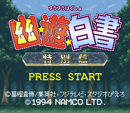

  

幽遊白書　特別篇@wikiへようこそ
  
このwikiは編集自由です。どなたでも自由に編集してください。
  
ただし 悪質な編集、荒らし行為 をされる方は編集禁止にします。

  

### ビジュアルバトルの真髄ここに極まる！

|  |  |  |
| --- | --- | --- |
| ジャンル | ビジュアルバトル |  |
| 対応機種 | スーパーファミコン |
| 発売・開発元 | ナムコ |
| 発売日 | 1994年12月22日 |

  

---

* でも防御コマンドの成功率が前作より格段に落ちているのが残念。防御の成功率は「一定」とのことですが、成功率 -- 凍矢で勝つ快感に目覚めたバトラー (2014-11-26 22:28:21)
* 防御コマンドのキャラごとの成功率ランキングとかもあれば嬉しいです -- 凍矢で勝つ快感に目覚めたバトラー (2014-11-26 22:34:43)
* ガード性能について調べていただいた方、本当にありがとうございました。やっぱりガード得手不得手に各キャラの「らしさ」が出ていて面白いですね。やっぱり凍矢はガード性能も弱いｗ呪氷凍身の回避率が高かったらなぁ -- 凍矢で勝つ快感に目覚めたバトラー (2015-05-29 15:36:51)
* 久しぶりの大量更新！編集者さん乙です。 -- 名無しさん (2015-06-16 09:55:34)
* こういう名作をいつまでも大切にしたいですね -- 名無しさん (2015-10-05 21:27:29)
* 疑問に思ったことがあるのですが、「脳内快楽物質」を使った状態の神谷の防御力・バランス耐久力はどのぐらいなんでしょうか？ -- 名無しさん (2016-03-17 12:43:54)
* バ耐は変化しません。防御力は60→41に変化します。(参考までに幽助の防御力は58、100%が50、黒龍飛影48です。) -- 名無しさん (2016-04-03 21:00:29)
* メニューを更新、ページ作成されていなかった[ゲーム概要](https://w.atwiki.jp//w.atwiki.jp/sfcyuhakutokubetsu/?page=%E3%82%B2%E3%83%BC%E3%83%A0%E6%A6%82%E8%A6%81)を外し、ガード性能・霊撃性能・基礎ステータス・パンチ性能をツリー化し、総当たり戦・システム詳細の項目を追加し、一部順序を変更しました。小ネタ・システム補足・システム詳細の項目は統廃合できそうな気がします。 -- 名無しさん (2016-09-23 21:53:09)
* リンクに判定シミュレータと個人攻略まとめを追加　技フレームが乗っています -- 名無しさん (2018-05-13 22:40:22)
* トップページコメント（ここ）を別頁化・ツリー化、初心者講座をメニューに追加　クラス分けは独断で勝手にしてるので不適切なら適当に変えて下さい - 名無しさん (2020-06-08 22:05:47)

名前:

---

タグ：

+ タグ編集

* タグ：

キャンセル
保存

タグの更新に失敗しました

エラーが発生しました。ページを更新してください。

[ページを更新](https://w.atwiki.jp/sfcyuhakutokubetsu/pages/1.html)

いいね！

[「トップページ」をウィキ内検索](https://w.atwiki.jp//w.atwiki.jp/sfcyuhakutokubetsu/search?andor=and&keyword=%E3%83%88%E3%83%83%E3%83%97%E3%83%9A%E3%83%BC%E3%82%B8)

最終更新：2020年06月08日 21:59