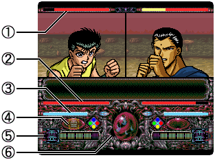

## メニュー操作

| 操作 | 詳細 |
| --- | --- |
| 十字キー | カーソルの移動 |
| A | 決定 メッセージの進行 |
| B | キャンセル |
| X |  |
| Y |  |
| START | OP画面の進行 トーナメント戦の早送り |
| SELECT |  |
| R |  |
| L |  |

## 戦闘画面

#### （１）　体力メーター

各使用キャラの残り体力。共通96ポイント。
  
黄色と赤色の二重になっており、最初は黄色メーター全快で始まり、赤メーターも尽きると敗北する。

#### （２）　闘気メーター

十字キーを押しっぱなしにする事で闘気が溜まっていく。
  
メーターの量が多いほど攻撃（行動）が成功しやすく、回避力も上がり、威力も奪バランスも高くなる。
  
このゲームで単に「メーター」と言うと大抵、このメーターを指している。

#### （３）　バランスメーター

相手の攻撃がかすったり、直撃すると減っていく。共通255ポイント。
  
バランスが減ると回避が下がる。（相手が攻撃以外の行動をとっていた場合は成功が下がる）
  
メーターが0未満になるとダウンし無防備になってしまう。ABXYいずれかのボタン連打で復帰が早くなる（十字キーは無関係）。ずらし押しも有効。
  
復帰後は全快状態になる。

#### （４）　アイテムストック

霊界水晶玉がたまに出すアイテムをストックする場所。A、Yで任意のタイミングで使用可能。
  
アイテムは全部で6種類。アイテム使用中の回避は[キャラクター](https://w.atwiki.jp//w.atwiki.jp/sfcyuhakutokubetsu/pages/15.html "キャラクター (2845d)")によって異なる。アイテムの種類による変化はない。

| 名前 | 詳細 |
| --- | --- |
| 愛(小) | 体力22ポイント回復、全体量の約23％ |
| 愛(大) | 体力28ポイント回復、全体量の約29％ |
| 気(小) | バランス192ポイント回復、全体量の約74％ |
| 気(大) | バランス全回復、更に3ターンの間バランスが減らなくなる |
| 霊(小) | 霊力5ポイント回復 |
| 霊(大) | 霊力8ポイント回復 |

#### （５）　霊気ゲージ

霊気水晶玉が出す霊気玉をストックするゲージ。霊撃や技はこれを消費して繰り出す。
  
全キャラ共通で初期値は20、最大25。

#### （６）　霊界水晶玉

ターンごとに霊気玉かアイテムが表示される。それぞれの行動結果に応じて中身が与えられる。
  
霊気玉は2～6個表示され、全部か、半分か、1個だけか、全く貰えないかのどれかになる。二人とも全部貰える事もある。
  
アイテムは行動が有利だった方に与えられる。相撃ちなどの場合は、二人とも何も与えられずに居座る。どちらかが有利な結果を出すまで残り続ける。

### 十字キー

各種行動の選択。押しっぱなしで闘気メーターが溜まるので、ABXYいずれかを押して最終的な行動を決める。
  
※コマンドは右向きのものとなります。

| 操作 | 技名 | 詳細 |
| --- | --- | --- |
| ↑ | 技 | 霊気ゲージを消費し、補助効果を掛ける |
| ← | 防御 | 相手の攻撃を回避または受け止める |
| → | パンチ | ノーコストの接触攻撃 |
| ↓ | 霊撃 | 霊気ゲージを消費し、主に攻撃を仕掛ける |

### 技

ジャンプ以外はキャラクターによって内容が異なる。共通技のジャンプも性能には個人差がある。詳しくは[キャラクター](https://w.atwiki.jp//www53.atwiki.jp/sfcyuhakutokubetsu/pages/15.html)または[総当たり戦](https://w.atwiki.jp//w.atwiki.jp/sfcyuhakutokubetsu/pages/59.html "総当たり戦 (1924d)")の個別ページで。
  
自己強化や敵弱体化、回復など効果は多岐にわたるが、直接相手を攻撃する技は全キャラクター中でも１つしかない。

| 操作 | 技名 | 詳細 |
| --- | --- | --- |
| A | 技1 | バランス回復を含む技が多い傾向にある |
| B | 技2 | 霊撃力アップや変身などの自己強化が多い傾向にある |
| X | ジャンプ | 一定時間空中に移動する。滞空時間はキャラクターにより異なる。先手と後手で大きく意味が変わる。 先手で出した場合は、ターン消費を伴わない唯一の行動。COM戦では効果は薄い。 後手で出した場合は、高い回避力で相手の攻撃を避けれる。ただし、ここで攻撃が直撃すると無条件にダウン |
| Y | 技3 | 回避や防御アップ、体力回復などの防御的効果が多い傾向にある |

後手ジャンプは相手の攻撃がカスる分には問題なく、霊気玉を全部受け取った上で空中に行ける。
  
しかしこの時バランスが残り少なく「おっと、よろめいた！」と表示された場合、霊気玉はもらえるが空中には行き損ねる。

### 防御

相手の行動決定後でないと決定できない。相手の攻撃を回避または防御が可能。
  
コマンド及び行動は全キャラ共通だが、細かい性能はキャラクターによって異なる。
  
※コマンドは右向きのものとなります。

| 操作 | 技名 | 詳細 |
| --- | --- | --- |
| A | 受ける | 成功すると被ダメージを約1/3に減らし、バランスも半分回復する 飛び・伸び・接触攻撃に対して有効。パンチに対しては成功率が下がる |
| B | 下段ガード | 接触霊撃と下パンチを回避する、成功時霊気ゲージ回収可能 |
| X | 上段ガード | 接触攻撃と上パンチを回避する、成功時霊気ゲージ回収可能 |
| Y | かわす | 飛び・伸び攻撃を高確率で回避する、成功時霊気ゲージ回収可能 成功失敗問わずバランスゲージ消費 |

### パンチ

霊気ゲージの消費なしで放てる、非常に弱い接触攻撃。
  
コマンド及び行動は全キャラ共通だが、細かい性能はキャラクターによって異なる。

| 操作 | 技名 | 詳細 |
| --- | --- | --- |
| A | 下強パンチ | 威力は高いが成功率、回避率、奪バランスが低い |
| B | 下連打パンチ | 成功率、回避率、奪バランスは高いが威力が低い |
| X | 上強パンチ | 威力は高いが成功率、回避率、奪バランスが低い |
| Y | 下連打パンチ | 成功率、回避率、奪バランスは高いが威力が低い |

### 霊撃

本作のメイン攻撃。当然、キャラクターによって内容は異なる。詳しくは[キャラクター](https://w.atwiki.jp//www53.atwiki.jp/sfcyuhakutokubetsu/pages/15.html)または[総当たり戦](https://w.atwiki.jp//w.atwiki.jp/sfcyuhakutokubetsu/pages/59.html "総当たり戦 (1924d)")の個別ページで。

| 操作 | 技名 | 詳細 |
| --- | --- | --- |
| A | 霊撃1 | 下3つに収まらない、または主力となる霊撃が多い |
| B | 霊撃2 | 地上霊撃がある場合は必ずここに設定されている。それ以外は安価な霊撃が多い |
| X | 霊撃3 | 最大霊撃を放つ。[戸愚呂兄](https://w.atwiki.jp//w.atwiki.jp/sfcyuhakutokubetsu/pages/29.html "戸愚呂兄 (1065d)")以外はすべて、飛び霊撃 |
| Y | 霊撃4 | 安価な飛び・伸びや衝撃波が多い傾向にある |

  
